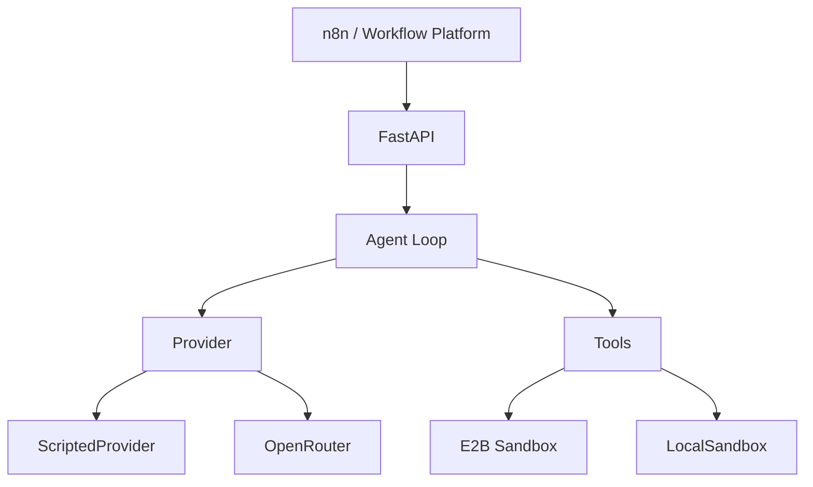

# Sandbox Agents

A cloud coding agent that runs as a **workflow node**. An n8n (or any HTTP workflow) step posts a task; the
agent gets its own isolated sandbox with a shell, a file system and a test runner, inspects the repository,
edits it, verifies the fix by running the tests, and returns a structured result.

The seed task: a small `listing_parser` package with two realistic bugs. The agent runs pytest, finds the
failures, patches the parser and ends with 8/8 tests passing.

## Architecture



| Component | Location | Notes |
|---|---|---|
| Agent loop | `agent/loop.py` | provider turn → tool calls → tool results, until the model stops calling tools |
| Tools | `agent/tools.py` | `bash`, `read_file`, `write_file`, `edit_file`, `search`; all confined to the workspace |
| Sandboxes | `agent/sandbox.py` | `E2BSandbox` (one microVM per run) and `LocalSandbox` (temp dir, for tests) |
| Providers | `agent/providers.py` | `OpenRouterProvider` (real) and `ScriptedProvider` (replays fixtures, $0) |
| Events | `agent/events.py` | ordered, replayable per-run log; streamed over SSE |
| Cost / budget | `agent/cost.py`, `agent/budget.py` | usage accounting and the persisted global spend guard |
| Registry | `agent/registry.py` | in-memory runs, concurrency semaphore, sandbox reaper |
| API + UI | `api/main.py`, `api/static/` | FastAPI, SSE, one static page (no framework, no build step) |

### Model routing

Real runs route the **first turn through OpenRouter's Jev Router** (`typesafe/jev-router`), which picks a
model for the task prompt. The chosen model (reported in the response's `model` field) is then pinned for the
rest of the run so Anthropic prompt caching keeps hitting. Set `MODEL_ROUTER=` (empty) to always use
`AGENT_MODEL` (default `anthropic/claude-haiku-4.5`). The routed model is shown in the UI and in the
`model_routed` event. Whatever Jev picks, the per-run cap and global budget guard still apply.

## Setup

```bash
uv sync --group dev
cp .env.example .env            # fill in keys only if you need real runs / E2B
make run                        # http://localhost:8000
```

Environment (`.env.example`):

| Variable | Meaning |
|---|---|
| `LLM_PROVIDER` | `mock` (default) or `openrouter`. See *Real runs* below |
| `SANDBOX_PROVIDER` | `local` (tests, CI) or `e2b` (deployed app). Defaults to `e2b` when unset |
| `OPENROUTER_API_KEY` | only needed for real runs |
| `E2B_API_KEY` | only needed with `SANDBOX_PROVIDER=e2b` |
| `AGENT_MODEL` | fallback / pinned model, default `anthropic/claude-haiku-4.5` |
| `MODEL_ROUTER` | `typesafe/jev-router` (default); empty disables routing |
| `DEMO_KEY` | value the `X-Demo-Key` header must match for a real run |
| `MAX_CONCURRENT_RUNS` | semaphore size, default 3 |
| `SPEND_FILE` | persisted spend ledger, `./data/spend.json` locally, `/data/spend.json` on Railway |

### Mock mode

`LLM_PROVIDER=mock` replays `tests/fixtures/scripted_fix_run.json`: the exact sequence a competent agent
performs (pytest → search → read → edit → edit → pytest → summary). It makes **no network calls** and costs
$0. The tools and sandbox are real; only the model is scripted. This is the default everywhere.

### E2B

Runtime sandboxes come from a custom template with Python 3.12, pytest and ripgrep preinstalled. Nothing is
installed inside a sandbox at runtime. Build it once:

```bash
E2B_API_KEY=... make build-template     # scripts/build_e2b_template.py, alias agent-loop-py312
```

Each run creates one `AsyncSandbox` from that template with a TTL, uploads `seed_repo/` to
`/home/user/workspace`, and kills the sandbox in `finally`. A reaper also kills sandboxes past their TTL or
idle timeout. Sandboxes are created with `allow_internet_access=False`.

### Real runs (OpenRouter)

The deployed app keeps `LLM_PROVIDER=mock` for everyone. A request uses OpenRouter only when **both**
`OPENROUTER_API_KEY` is configured on the server **and** the request carries `X-Demo-Key: <DEMO_KEY>`.
Any other request (no key, wrong key) silently runs in mock mode and the UI shows `MOCK`.

If the server is explicitly started with `LLM_PROVIDER=openrouter`, a missing or wrong `X-Demo-Key`
returns `403`.

In the UI, press `r` twice (outside an input) to reveal the demo-key field.

## Testing

```bash
make test        # unit + API + Playwright e2e. Mock provider, LocalSandbox. Never calls a real LLM or E2B.
make test-e2b    # real E2B sandboxes with the scripted provider. Needs E2B_API_KEY. No LLM calls.
make smoke       # ONE real run with the configured model. Prompts you to type "run real". Spends credit.
```

`make test` never calls a real LLM. CI runs exactly `make test` with `LLM_PROVIDER=mock` and
`SANDBOX_PROVIDER=local` and receives no API keys.

Screenshots from the e2e suite land in `tests/e2e/screenshots/` (1440px and 390px).

## Budget protection

The OpenRouter account has roughly **$5** of credit. Layers, outermost first:

1. **OpenRouter account credit** — the final external backstop. The key cannot spend more than the account
   holds. Keep a credit limit on the key in the OpenRouter dashboard.
2. **Application ceiling: $4.00** (`config.yaml` → `budget.global_ceiling_usd`). Actual spend is persisted
   in `SPEND_FILE` under a file lock after every real model turn. A real run is refused when spend has
   reached $4.00 or when its `max_cost_usd` exceeds what remains. The remaining ~$1.00 is an emergency
   margin that the app never touches. The UI never shows more than `$4.000 remaining`.
3. **Per-run cap: $0.25** by default (`max_cost_usd` in `POST /runs`, hard-limited to $1.00). The run stops
   as soon as its accumulated cost exceeds the cap.
4. **Demo key**: real runs require `X-Demo-Key` matching `DEMO_KEY`.
5. **Explicit intent**: no real run is ever started by development, tests, CI or `make test`. `make smoke`
   requires typing `run real`.

Cost is taken from OpenRouter's accounted `usage.cost` (always present in responses). If it were ever
missing, cost is computed from token counts and the prices in `config.yaml` (including cached-token pricing);
an unpriced model with no accounted cost is an error, never a guess.

## API

| Endpoint | Purpose |
|---|---|
| `POST /runs` | start a run; body `{task, max_turns, max_cost_usd}` → `{run_id}` |
| `POST /runs?wait=true` | block until the run completes and return the final result (**the n8n node**) |
| `POST /runs/batch` | `{task, count ≤ 3}` → three concurrent runs, three sandboxes |
| `GET /runs/{id}/events` | SSE: replays history, streams live events, closes on completion |
| `GET /runs` | in-memory runs |
| `GET /budget` | `{spent, remaining}`; remaining is capped at 4.000 |
| `GET /status` | provider/sandbox configuration the UI displays |

Events: `run_started`, `model_routed`, `usage`, `assistant_text`, `tool_call`, `tool_result` (edits include
a unified diff), `run_finished` (`status, summary, tests_passed, tests_failed, turns, tokens, cost`), `error`.

## n8n

Import `n8n/workflow.json`: Manual Trigger → HTTP Request (`POST /runs?wait=true`) → Set
(`status`, `tests`, `cost`, `summary`). Set `AGENT_BASE_URL` (and `AGENT_DEMO_KEY` for real runs) in n8n's
environment.

## Deployment (Railway)

The Dockerfile runs the API with uv on Python 3.12. The Railway service `api` in project `agent-loop-demo`
deploys from this repository with a persistent volume mounted at `/data`, so `/data/spend.json` survives
restarts and redeploys. Variables set on the service:

```
LLM_PROVIDER=mock
SANDBOX_PROVIDER=e2b
AGENT_MODEL=anthropic/claude-haiku-4.5
MODEL_ROUTER=typesafe/jev-router
MAX_CONCURRENT_RUNS=3
SPEND_FILE=/data/spend.json
PORT=8000             # the service domain targets 8000
OPENROUTER_API_KEY=   # set only for the recorded demo
E2B_API_KEY=          # required for sandboxes
DEMO_KEY=             # required for real runs
```

The real-provider path is never enabled until the user explicitly says `run real`.

## Limitations of the prototype

- Runs and events live in memory; a restart forgets them (spend does not: it is on disk).
- Sandbox internet is disabled with the E2B SDK's `allow_internet_access=False`. The SDK also supports
  finer `network` rules; the prototype does not use them.
- The Jev router's candidate set cannot be restricted from the request; the budget guards are the
  protection against an expensive pick.
- One process, one host. See below for the production path.

## Production path (not implemented)

What this would become beyond the prototype:

- **Kubernetes** with a **gVisor `RuntimeClass`** or **Firecracker** microVMs per run instead of E2B.
- A **warm sandbox pool** so a run starts in milliseconds.
- An **egress proxy with an allowlist** (package registries only) rather than no network at all.
- **Secret injection** at run start, scoped per task, never baked into images.
- **Per-tenant quotas** for concurrency, spend and sandbox minutes.
- **Postgres** for runs and events so SSE replay and audit survive restarts and scale across replicas.
